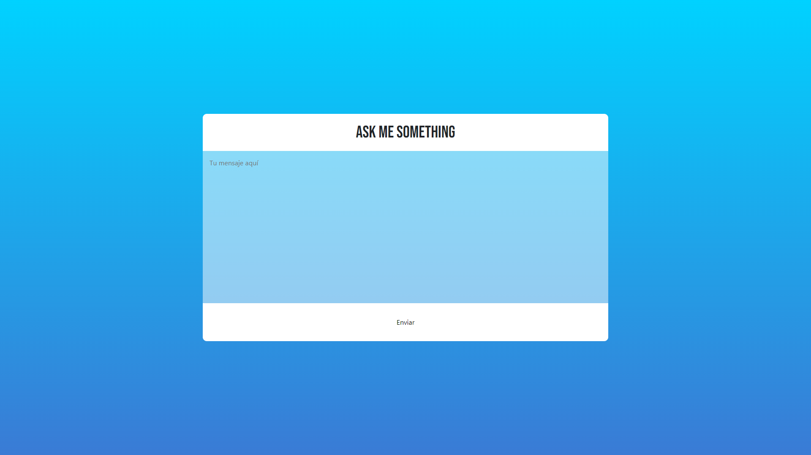

# Ask Me Something

An anonymous one-way messaging service.

## Description

A user sends any message using the [main page](./static/index.html). When it is sent, they will get redirected to the [success page](./static/success.html) or the [error page](./static/error.html), according to the result.

To view the messages, the admin may go to the [view page](./static/view.html), where the system will ask for a password. This password is a one time password that will get printed on the server console.

The server uses a RESTful API to communicate with the client. On the [server script](./server.js), two endpoints are declared. `/api/post` to post a message, and `/api/get` to get the messages (supplying the appropiate password). The database runs on SQLite3 and gets stored under `.data/database.db`
